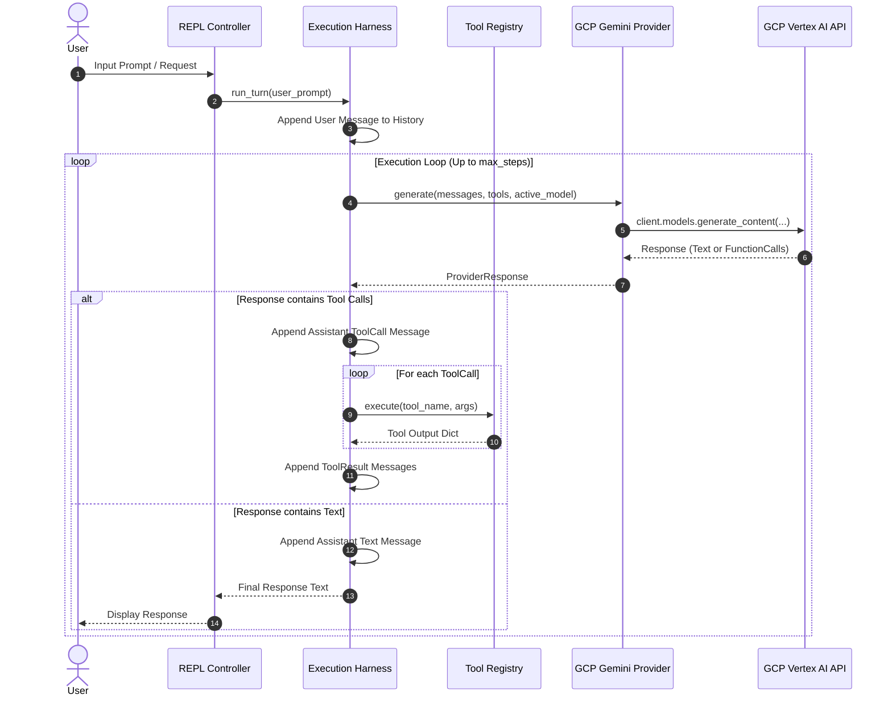

# System Architecture Design Document: `harnessfun`

**Project:** `harnessfun`  
**Document Version:** 1.0.0  
**Status:** Approved for Implementation  
**Location:** `/home/jeffleinen/jeffdev/harnessfun/ARCHITECTURE.md`  

---

## 1. System Overview & Core Principles

`harnessfun` is an extensible, provider-agnostic LLM Execution Harness and interactive REPL designed to run multi-step tool execution loops. Its primary design goals are:

1. **GCP Native Identity & Governance:** Strictly relies on Google Cloud Application Default Credentials (ADC) and IAM Project roles—disallowing hardcoded API keys.
2. **Dynamic Model Agnosticism:** Decouples harness execution logic from model definitions, enabling on-the-fly switching across any available Google Gemini model.
3. **Interactive REPL & Session Persistence:** Provides a rich interactive CLI session supporting `/slash` commands for runtime model switching, history management, and context inspection.
4. **Tool Registry & Automation:** Provides a clean Python decorator interface (`@registry.register`) to convert functions into LLM-callable tools.

---

## 2. High-Level Architecture Diagram

```mermaid
flowchart TD
    subgraph UI ["User Interface Layer"]
        CLI["harnessfun CLI (Click / Typer)"]
        REPL["Interactive REPL Controller (prompt_toolkit / rich)"]
        CMD["Slash Command Dispatcher (/model, /models, /clear, etc.)"]
    end

    subgraph Core ["Harness Core Engine"]
        Session["Session State Manager (History, Config, Active Model)"]
        Loop["Execution Loop Controller (while not done)"]
        ToolReg["Tool Registry (@register, Schema Generator, Exec)"]
    end

    subgraph Abstraction ["Provider Abstraction Layer"]
        BaseAdapter["BaseLLMProvider (Abstract Base Class)"]
        GCPAdapter["GCPGeminiProvider (google-genai SDK)"]
    end

    subgraph Infra ["Google Cloud Platform Infrastructure"]
        ADC["Google Cloud Auth (google.auth.default)"]
        Vertex["Vertex AI / Gemini API Endpoint"]
    end

    CLI -->|Command 'chat'| REPL
    REPL --> CMD
    REPL --> Session
    CMD -->|Switch Model / Clear| Session
    Session --> Loop
    Loop --> ToolReg
    Loop --> BaseAdapter
    BaseAdapter <|-- GCPAdapter
    GCPAdapter --> ADC
    ADC -->|Validate Project/IAM| Vertex
    GCPAdapter -->|generate_content / list_models| Vertex
```

---

## 3. Data Models & Normalization

To decouple the execution engine from any specific provider SDK, `harnessfun` defines normalized internal data structures in `harnessfun/models.py`.

### 3.1 Data Structures
```python
from dataclasses import dataclass, field
from typing import Dict, Any, List, Optional

@dataclass
class ToolCall:
    id: str
    name: str
    args: Dict[str, Any]

@dataclass
class ToolResult:
    call_id: str
    name: str
    output: Dict[str, Any]

@dataclass
class Message:
    role: str  # "system", "user", "assistant", "tool"
    content: Optional[str] = None
    tool_calls: List[ToolCall] = field(default_factory=list)
    tool_results: List[ToolResult] = field(default_factory=list)

@dataclass
class ProviderResponse:
    text: Optional[str] = None
    tool_calls: List[ToolCall] = field(default_factory=list)

@dataclass
class SessionConfig:
    project_id: str
    location: str
    active_model: str = "gemini-2.5-flash"
    system_instruction: str = "You are a helpful assistant with access to local tools."
    max_steps: int = 10
```

---

## 4. GCP Authentication & Security Subsystem

### 4.1 ADC Enforcement Logic
Authentication is strictly governed by `harnessfun/config.py`:

```
┌─────────────────────────────────────────────────────────┐
│              Config Initialization                      │
└────────────────────────────┬────────────────────────────┘
                             │
                             ▼
              Does GEMINI_API_KEY exist in env?
              ├── YES ──► RAISE SecurityValidationError ("API Keys prohibited")
              └── NO  ──► Proceed to GCP ADC Check
                             │
                             ▼
              Call google.auth.default()
              ├── Success ──► Resolve GOOGLE_CLOUD_PROJECT & Location
              └── Failure ──► RAISE AuthError ("Run 'gcloud auth application-default login'")
```

* **No API Keys Rule:** The configuration loader explicitly scans for `GEMINI_API_KEY` or `--api-key` inputs and raises a `SecurityValidationError` if detected.
* **ADC Resolution:** Resolves credentials via `google.auth.default()`. Reads the active project ID from environment variables (`GOOGLE_CLOUD_PROJECT`), standard GCP quota config, or explicit CLI flag.

---

## 5. Provider Adapter Architecture (Strategy Pattern)

### 5.1 Abstract Base Class (`BaseLLMProvider`)
Defines the required interface for model interactions and model discovery:

```python
from abc import ABC, abstractmethod
from typing import List, Callable
from harnessfun.models import Message, ProviderResponse

class BaseLLMProvider(ABC):

    @abstractmethod
    def generate(
        self,
        messages: List[Message],
        tools: List[Callable],
        model: str,
        system_instruction: str
    ) -> ProviderResponse:
        """Translates normalized messages -> provider SDK -> normalized response."""
        pass

    @abstractmethod
    def list_models(self) -> List[str]:
        """Queries and returns list of available model IDs."""
        pass
```

### 5.2 GCP Gemini Adapter (`GCPGeminiProvider`)
Uses the official `google-genai` SDK in Vertex AI mode:

* **SDK Setup:** Initialized via `genai.Client(vertexai=True, project=project_id, location=location)`.
* **Model Discovery:** `list_models()` executes `client.models.list()` and filters for models supporting text/function content generation.
* **Format Conversion:** Translates normalized `Message` objects into `types.Content` and `types.Part` objects, and converts Gemini's `response.function_calls` into normalized `ToolCall` instances.

---

## 6. Interactive REPL Subsystem

The REPL is driven by `harnessfun/cli.py` using `rich` for formatting and a command parsing loop.

### 6.1 Slash Command Execution Matrix

```
[User Input] ──► Starts with '/'?
                    ├── YES ──► Intercepted by SlashCommandDispatcher
                    └── NO  ──► Sent to Universal Harness Execution Loop
```

* **/model `<model_id>`:** Updates `session.config.active_model` dynamically. If no argument is passed, lists active model and recent prompt usage.
* **/models:** Calls `provider.list_models()` and outputs a clean table of available Gemini models in the active GCP project.
* **/clear:** Empties `session.messages` list while preserving system prompts and registered tools.
* **/system `<prompt>`:** Updates `session.config.system_instruction`.
* **/tools:** Displays a formatted list of registered Python functions, their parameter signatures, and docstrings.
* **/info:** Prints active GCP Project ID, region, current model, and session turn metrics.
* **/exit / /quit:** Exits loop with status code 0.

---

## 7. Execution Loop & Tool Registry Sequence



---

## 8. Directory Layout & Module Responsibilities

```text
/home/jeffleinen/jeffdev/harnessfun/
├── ARCHITECTURE.md             # System Architecture Design Document
├── PRD.md                      # Product Requirement Document
├── README.md                   # Setup and usage guide
├── pyproject.toml              # Dependencies (google-genai, click, rich, pydantic)
├── config.example.yaml         # Sample configuration file
├── harnessfun/
│   ├── __init__.py
│   ├── cli.py                  # CLI entrypoint & REPL Interactive Loop
│   ├── config.py               # GCP ADC validation & settings loader
│   ├── harness.py              # Universal Execution Harness loop logic
│   ├── tools.py                # Decorator-based Tool Registry
│   ├── models.py               # Normalized Data Models (Message, ToolCall, etc.)
│   └── providers/
│       ├── __init__.py
│       ├── base.py             # Abstract Base Class (BaseLLMProvider)
│       └── gcp_gemini.py       # GCP / Vertex AI Gemini Adapter
└── tests/
    ├── test_config.py          # Unit tests for ADC auth enforcement
    ├── test_harness.py         # Unit tests for execution loop & tool calls
    └── test_provider.py        # Integration tests for GCP Gemini provider
```
